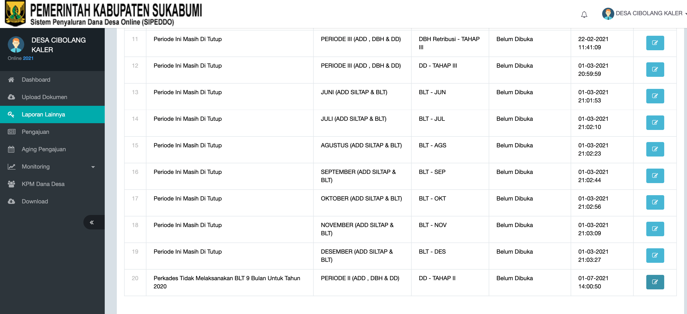
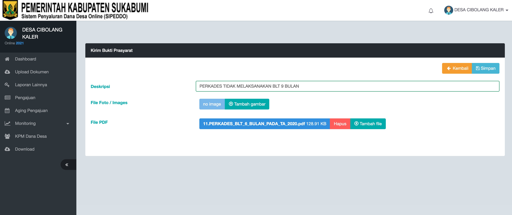
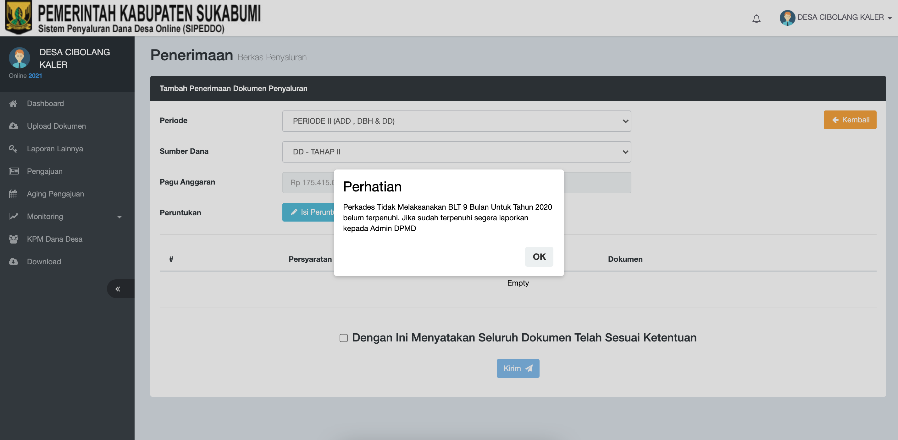
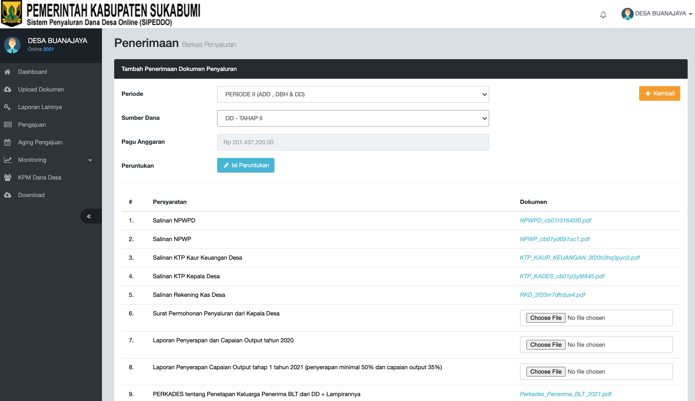

# Update Penting - Penyaluran DD Tahap II

## **Login Ke Aplikasi Sipeddo**

di Alamat :   : [http://sipeddo-sukabumikab.simdacloud.id/](http://sipeddo-sukabumikab.simdacloud.id/)

## **Masuk Ke Menu "Laporan Lainnya"**

## **Unggah Dokumen dengan format PDF**

1. Tambahkan Deskripsi "Perkades Tidak Melaksanakan BLT 9 Bulan untuk Tahun 2020"
2. Tambah File PDF dan masukkan "Perkades Tidak Melaksanakan BLT 9 Bulan untuk Tahun 2020"
3. Pilih dan Klik Simpan

### Selanjutnya Masuk ke Menu "Pengajuan"

* Jika muncul notifikasi seperti gambar diatas, segera konfirmasi kepada admin;
* Admin akan mengechek apakah Perkades yang telah di Upload tersebut sudah sesuai dengan ketentuan.

## Apabila Sudah Di Setujui dan Dokumen yang di Upload Sesuai, proses selanjutnya seperti gambar yang dibawah

* Jika semua Tahapan selesai, silahkan chek ulang, apakah berkas sudah terUpload semua ke dalam Aplikasi SIPEDDO, 
* jika belum "Choose File" ke Berkas yang belum di Upload.

### CATATAN PENGAJUAN

* Untuk Laporan Penyerapan dan Capaian Output Tahap I Tahun 2021 silahkan meminta laporan yang bersumber dari omspan ke Admin Sipedo.
* Untuk Laporan Realisasi dan Capaian Output Tahun 2020 silahkan meminta laporan yang bersumber dari omspan ke Admin Sipedo.
* Bagi Pemerintah Desa Dengan Status Pengajuan Reguler dan Mandiri, yang menganggarkan BLT Tahun 2020 selama 9 bulan silahkan langsung masuk ke menu pengajuan.
* Bagi Pemerintah Desa Dengan Status Desa Mandiri, untuk tahap II di tambah Persyaratan Laporan Konvergensi Stunting Tahun 2020.

