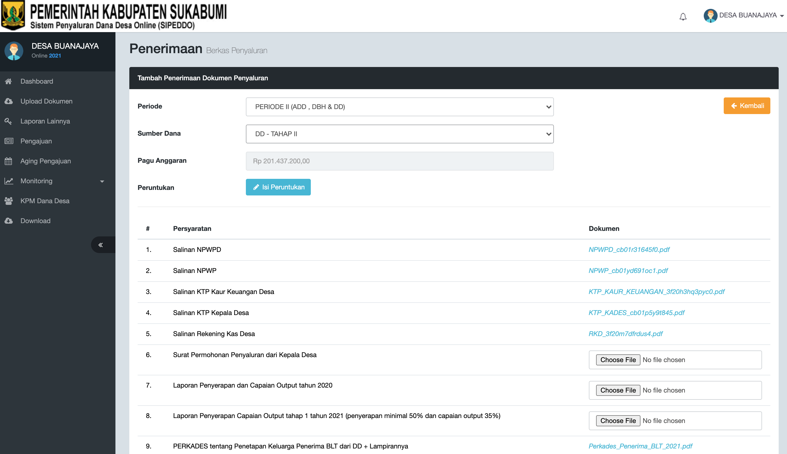

# Penyaluran DD Tahap III

## ALUR PENYALURAN

## **Login Ke Aplikasi Sipeddo**

di Alamat :   : [http://sipeddo-sukabumikab.simdacloud.id/](http://sipeddo-sukabumikab.simdacloud.id/)

## **Masuk Ke Menu "Laporan Lainnya"**

### Selanjutnya Masuk ke Menu "Pengajuan"

* Jika muncul notifikasi seperti gambar diatas, segera konfirmasi kepada admin;
* Admin akan **mengcek** apakah Laporan Realisasi Capaian Output dan Laporan Realisasi Penyaluran BLT yang telah di Upload tersebut sudah sesuai.

## Apabila Sudah Di Setujui dan Dokumen yang di Upload Sesuai, proses selanjutnya seperti gambar yang dibawah

* Jika semua Tahapan selesai, silahkan chek ulang, apakah berkas sudah terUpload semua ke dalam Aplikasi SIPEDDO, 
* jika belum "Choose File" ke Berkas yang belum di Upload.

### CATATAN PENGAJUAN

* Untuk Laporan Penyerapan dan Capaian Output Sampai Dengan Tahap II Tahun 2021 silahkan meminta laporan yang bersumber dari omspan ke Admin Sipedo.
* Untuk Laporan Konvergensi Stunting Silahkan Meminta Laporan **Ke No Wa : +62852-1712-0971 \(Sdr. Pak Iman \) \(Kasi Pengembangan Pelayananan Sosial Dasar\)**

